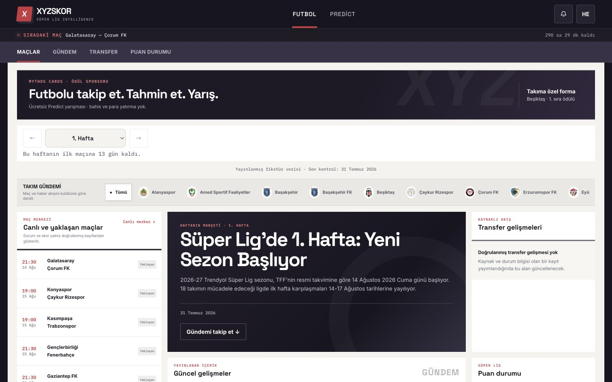
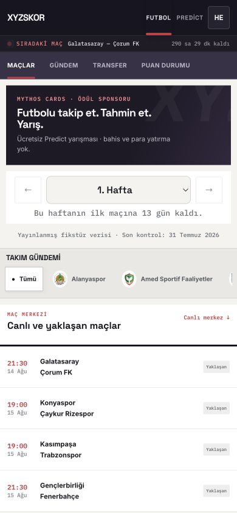
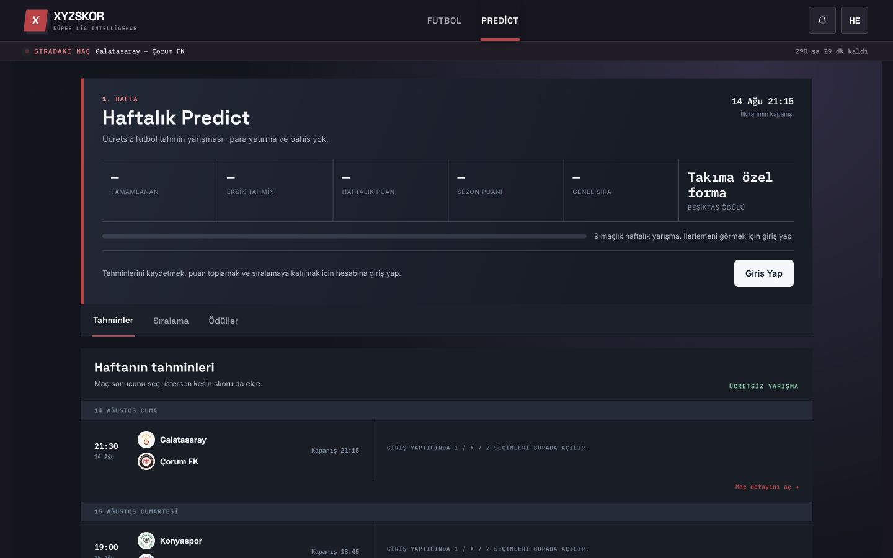
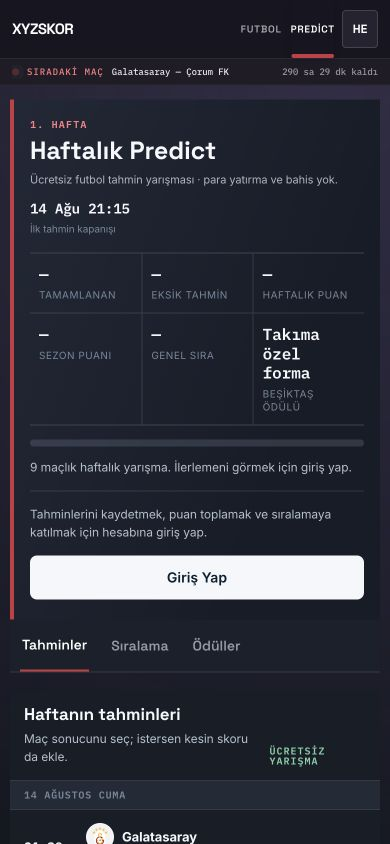

# XYZSKOR — Max Capacity Visual Product Redesign Sonuç Raporu

Tarih: 2 Ağustos 2026

## Mevcut Tasarımda Bulunan Problemler

- Futbol içeriği aynı lacivert, yuvarlak kart dilinde eşit önemde görünüyordu.
- Masaüstü, mobil kartların büyütülmüş haliydi; geniş ekran kolon kapasitesi kullanılmıyordu.
- Maçlar hızlı taranan satırlar yerine ayrı kutular içindeydi.
- Manşet, gündem, transfer ve puan durumu arasında güçlü bir görsel hiyerarşi yoktu.
- Sponsor/banner ve sağ rail envanteri bulunmuyordu.
- Mobil header 131 px yüksekliğindeydi ve gerçek içerik geç başlıyordu.
- Predict, Futbol ile aynı dashboard hissini taşıyordu.
- Eski hikâye düzeni yeni modüllerin altında tekrar ederek sayfayı gereksiz uzatıyordu.

## Seçilen Tasarım Yönü

Editoryal spor portalı, yoğun canlı maç rail'i ve ayrı yarışma modu birlikte kullanıldı. Global ürün kabuğu koyu tutuldu; Futbol açık ve editoryal, Predict koyu ve yarışma odaklı tasarlandı. Ana navigasyon yalnız Futbol ve Predict olarak korundu.

## Değiştirilen Dosyalar

- `index.html`: tasarım sistemi, header, iç navigasyon, Futbol kompozisyonu, Predict görünümü, takım filtresi ve gerçek ödül sponsor alanları.
- `scripts/check.mjs`: yeni iki alan mimarisi, takım filtresi, sponsor güvenliği, responsive grid ve reduced-motion kontrolleri.
- `reports/MAX-CAPACITY-DESIGN-DIAGNOSIS.md`: başlangıç teşhisi ve tasarım yönü.
- `reports/MAX-CAPACITY-VISUAL-REDESIGN.md`: bu sonuç raporu.
- `reports/screenshots/*.png`: son masaüstü ve mobil görsel doğrulama çıktıları.

## Oluşturulan Design System

- Global kabuk: gece laciverti ve morumsu kömür.
- Futbol yüzeyi: kırık beyaz, beyaz kolonlar, ince bölücüler.
- Ana vurgu: erişilebilir koyu mercan-kırmızı.
- Canlı/success: kontrollü yeşil; resmî kaynak: mavi.
- Radius yalnız yardımcı kontrollerde; ana içerik satır ve kolon düzeninde.
- Skor, saat ve metadata için tabular/mono tipografi; manşet ve başlıklarda güçlü display tipografisi.
- Masaüstü ana grid: 340 px maç rail'i, esnek manşet/gündem, 290 px transfer/puan/sponsor rail'i.

## Header ve Navigasyon Değişiklikleri

- Header 66 px masaüstü, 58 px mobil yüksekliğe indirildi.
- Futbol ve Predict büyük kart butonlarından çıkarılıp ürün modu sekmelerine dönüştürüldü.
- Futbol içinde Maçlar, Gündem, Transfer ve Puan Durumu sekmeleri eklendi.
- İç sekmeler sticky çalışıyor; Predict açıldığında gizleniyor.
- Profil, bildirim ve admin üçüncü ana ürün alanına dönüştürülmedi.

## Futbol Ekranı Değişiklikleri

- Gerçek maçlar hızlı taranan satır rail'ine dönüştürüldü.
- Yayınlanmış haftalık hikâye büyük tipografik manşet olarak düzenlendi.
- Haberler kaynak, tarih, yazar/oyuncu/takım kimliği ve güven seviyesiyle editoryal akışa dönüştürüldü.
- Transfer ve puan durumu sağ rail'de kompaktlaştırıldı.
- Üst banner ve sağ sponsor rail'i eklendi; yalnız açıklanmış gerçek ödül kaydı kullanılıyor.
- Takım filtresi maç ve puan tablosundaki gerçek takım adlarından üretiliyor; maç, gündem ve transfer akışını birlikte filtreliyor.
- Gerçek görsel bulunmayan içerikte sahte fotoğraf yerine tipografik manşet kullanılıyor.
- Canlı veri merkezi ana akışın altında korunarak yeniden açık yüzeye uyarlandı.

## Predict Ekranı Değişiklikleri

- Predict koyu, enerjik ve Futbol'dan belirgin biçimde ayrı bir yarışma modu oldu.
- Haftalık ilerleme, kapanış zamanı, puan, sıra ve ödül aynı üst bantta toplandı.
- Tahminler masaüstünde fikstür ve seçim alanı olarak yatay satıra dönüştürüldü.
- Mobil özet üç sütuna sıkıştırıldı; tahmin listesine erişim hızlandırıldı.
- Ücretsiz yarışma, bahis ve para yatırma olmadığı görünür biçimde korundu.

## Kaldırılan Monoton Component Kalıpları

- Eş ölçülü lacivert dashboard kartları.
- Her maç için bağımsız yuvarlak kutu.
- Yeni portalın altında tekrar eden eski hikâye kartları.
- Boş görsel alanı izlenimi veren manşet kutusu.
- Predict içindeki kutu-içinde-kutu görünümü.

## Responsive Kontroller

360, 390, 430, 768, 1024, 1280 ve 1440 px genişliklerde gerçek tarayıcıyla kontrol edildi. Hiçbir genişlikte yatay taşma bulunmadı.

- 360–430 px: tek kolon, 58 px header, 44 px Futbol iç sekmeleri; ilk dört maçtan sonra manşet.
- 768–1024 px: maç rail'i ve ana editoryal kolon; sağ rail içerikleri aşağıda devam ediyor.
- 1280–1440 px: üç kolonlu tam portal kompozisyonu.
- Ana ürün sekmeleri en az 58/66 px; Futbol iç sekmeleri en az 44/48 px dokunma yüksekliğinde.

## Erişilebilirlik Kontrolleri

- Klavye ile haber kartı Enter tuşuyla açıldı, Escape ile kapandı.
- Haber ve hesap modallarının `aria-hidden` durumu açılış/kapanışta doğrulandı.
- Takım filtresinde `aria-pressed`, ürün geçişinde aktif durum ve bölüm sekmelerinde görünür focus stilleri bulunuyor.
- Renk kontrastı için küçük kırmızı ve gri metadata tonları koyulaştırıldı.
- `prefers-reduced-motion` desteği eklendi.
- 44 px altına düşmeyen ana dokunma hedefleri korundu.

## Çalıştırılan Testler

- `npm run check`
- `npm run build`
- 7 responsive genişlikte overflow ve boyut ölçümü
- Futbol/Predict ürün geçişi
- Futbol iç bölüm sekmeleri
- Galatasaray takım filtresi: 7 maçtan 1 gerçek eşleşmeye daralma
- Haber detay modalı
- Maç Merkezi modalı
- Hesap drawer'ı
- Haber kartında Enter/Escape klavye akışı
- Gerçek verisi olmayan haber/transfer filtre durumları
- Tarayıcı console kontrolü

## Test Sonuçları

- Statik ve iş mantığı kontrolü başarılı.
- Production build başarılı ve `dist/` üretildi.
- 360–1440 px arasında yatay taşma yok.
- Futbol/Predict, modal ve takım filtresi etkileşimleri başarılı.
- Tarayıcıda JavaScript hatası görülmedi.
- Yerel ortamda canlı Edge Function isteği ağ uyarısı verdi; ekran bunu kontrollü canlı veri boş durumu olarak ele alıyor.

## Görsel İterasyonlar

1. İlk kapsamlı uygulamada üç kolonlu portal, banner, takım şeridi ve ayrı Predict modu kuruldu. Görsel kontrolde hafta seçicinin eski koyu stil taşıdığı, eski kartlı hikâye alanının tekrar göründüğü ve mobil akışın uzun kaldığı belirlendi.
2. İkinci iterasyonda hafta kontrolü düzeltildi, eski tekrar alanı kaldırıldı, mobil maç rail'i dört satıra indirildi, Predict özeti sıkıştırıldı ve sayfa yüksekliği yaklaşık yarıya düşürüldü.
3. Son erişilebilirlik turunda kontrast, sticky iç navigasyon, scroll offset ve focus halkaları iyileştirildi.

## Korunan İş Mantıkları

- Supabase veri çekme zinciri.
- Auth ve hesap akışı.
- Tahmin kaydetme ve 15 dakika kilidi.
- `computeMatchPoints` ve liderlik hesaplamaları.
- Maç Merkezi detay sorguları.
- RLS, migration, Edge Function ve şema yapısı.
- Mythos Cards'ın yalnız ödül sponsoru rolü.
- Ana navigasyonda yalnız Futbol ve Predict kuralı.

## Gerçek Veri Eksikliği Nedeniyle Gizlenen Alanlar

- Kaynaklı transfer kaydı yoksa transfer listesi yerine açık boş durum gösteriliyor.
- Görsel URL'si yoksa sahte veya stok futbol görseli üretilmiyor.
- Oturum yoksa kullanıcı puanı ve sırası `—` gösteriliyor.
- Açıklanmış ödül yoksa ürün uydurulmuyor; ödül programının güncellendiği belirtiliyor.
- Sosyal takipçi, yorum, izlenme veya yapay kullanıcı sayacı üretilmiyor.

## Kalan Riskler

- Yerel ortam canlı Edge Function'a ulaşamadığı için gerçek canlı skor yanıtı bu turda uçtan uca doğrulanamadı.
- Auth ile gerçek kullanıcı oturumu ve tahmin yazma işlemi görsel QA sırasında değiştirilmedi; mevcut statik iş mantığı testleri başarılı.
- Çalışma klasörü bir Git deposu değil; commit/push veya yayın yapılmadı.
- Yayına almadan önce hedef hosting ortamında Supabase Function erişimi, font yüklemesi ve gerçek mobil cihaz testi tekrarlanmalı.

## Son Ekran Görüntüleri

### Futbol — Masaüstü

### Futbol — Mobil

### Predict — Masaüstü

### Predict — Mobil

